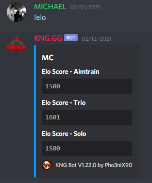

# King Bot

A Robust discord bot, with multiple features and support for multiple Rust servers.

## Self Host Requirements

- [Node.js](http://nodejs.org/)
- [Discord](https://discordapp.com/) account
- [PM2]() to handle process management.
- [Steam API KEY]()
- [Discord BOT Token]()

## Installation Steps (if applicable)

1. Copy contents of zip to where you want them
2. Run `npm install`
3. Fill out the `config.js` file
3. Run `node KNG_Bot.js` or `pm2 start KNG_Bot.js`

## Features
* All commands can be assigned by role.

1. `!stats` Rust Stats.
   * 
2. `!combatlog` Retrieval of Combatlogs from a server. Automatically replaces netids with player names
   * 
3. `!elo` `!elotop` ELO System, with dynamic image creation.
   *  
4. `!fps` Check FPS of a server.
5. Authing/Linking Steam account and Discord.
   * 2 methods of authing:
     1. By sending `!auth` in discord, the bot will PM you a link to click, sign into steam, and done.
     2. By sending `/auth` in game, you will receive a code to PM to the bot.
   * Can assign a role to discord when authed, and assign a group in game.
   * 
6. `!cinfo` Get Clan info from a server.
   * 
7. `!tinfo` Get Team info from a server.
   * 
8. `!find` Find a player on one of your servers.
    * **Authed Players:** steamid, steamname, discordid, dicordname
      * 
    * **Un-Authed Players:** steamid, steamname
      * 
9. `!connect` show ways to connect to your servers.
   *  
10. Supports message analysis, to respond to users based on predefined rules and messages.
11. `!netid` converts a netid to a steamid, if authed, it will give you their discord details as well.
    * 
12. `!players` shows players on a server
13. `!poll` creates a simple poll
    * 
14. Message analysis to automatically reply to users, based on keywords.
15. Ticketing system
    * Users can create a ticket.
    * They can be prompted predefined questions.
    * Can setup to only ping staff once questionnaire is done.
    * Player details will automatically be displayed when authed.
    * Transcripts will automatically save to a predefined channel, and saved into a DB if the channel gets lost
    * Supports auto closure when no response has been received for a predefined time.
    * Creates a static Discord look-alike HTML transcript file. For later review.
    * Ability to show the users previous X tickets
    * Auto closure of tickets that are dormant for X hours.
    * Auto deletion of tickets that have been closed for X hours, and transcripts them.